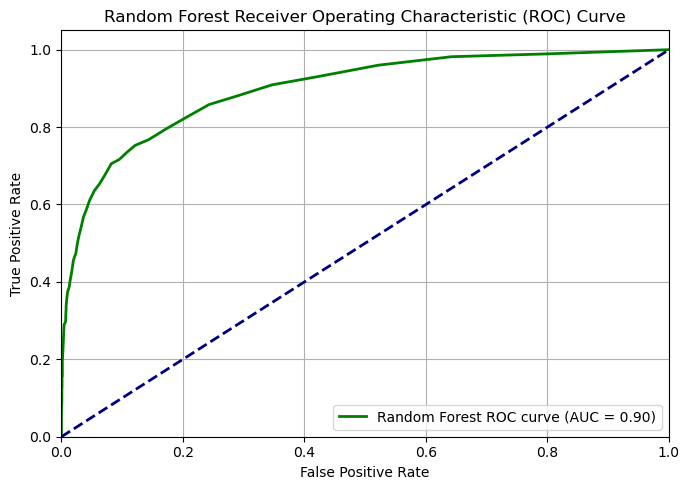

# Credit-Risk-Predictor
 A machine learning model to **predict credit default risk** using a dataset of loan applicants. The goal is to help financial institutions **balance between accepting more applicants** and **minimizing loan defaults**, which can lead to major financial loss.

---

## Objective

Develop a classification model that:
- Identifies **high-risk loan applicants** (likely to default),
- Maintains **high recall** for defaulters,
- Minimizes **false positives**, i.e., avoids wrongly labeling good customers as defaulters,
- Allows **threshold tuning** to align with business strategy.

---

## ⚖️ The Business Trade-Off

In real-world lending decisions, there’s a **critical trade-off**:

- **Approving more loans** increases revenue and customer acquisition.
- But **approving too many risky applicants** leads to **higher default rates**.

### Two types of prediction errors:
| Error Type | Description | Cost |
|------------|-------------|------|
| False Positive (FP) | Predicting someone **will default** when they won’t | ❌ Lost revenue, unhappy rejected customers |
| False Negative (FN) | Predicting someone **won’t default** when they do | ❌ Direct financial loss due to unpaid loans |

> The goal is to find the **right threshold** that balances business growth with financial safety.

---

## Dataset Summary

- Total records: 4000
- Features: Demographics, financial metrics, housing type, etc.
- Target: `default` (0 = no, 1 = yes)
- Strong class imbalance (~93% non-defaulters, 7% defaulters)

---

## Model Used

- **Random Forest Classifier**
- **Class weights** and **SMOTE** used to handle class imbalance
- Custom threshold tuning (e.g., 0.3–0.5) for maximizing recall

---

## Final Model Performance (Threshold = 0.15)
Here threshold 0.15 is choosen to get balanced result. But the value of thresold can be changed accoring to the market condition. Higher threshold means accepting larger number of applicants and vice versa.
| Metric          | Value |
|-----------------|--------|
| Accuracy         | 91%    |
| Recall (Default) | 66%  |
| Precision (Default) | 40% |
| ROC-AUC Score    | 0.905  |

### Confusion Matrix
|| Predicted 0| Predicted 1|
|--------|------------|------------|
|Actual 0| 3451| 274|
|Actual 1| 93  | 182|
### 📈 ROC Curve

